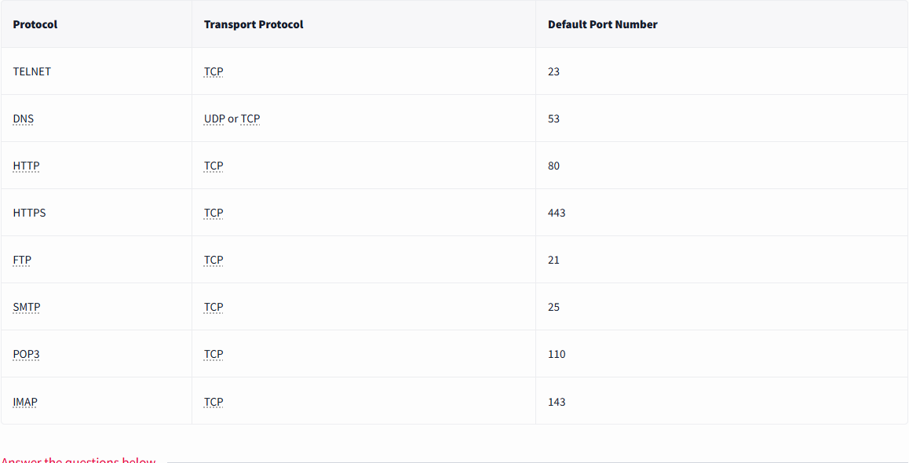

# 3 Networking Core Protocols

## 3.2 DNS:Remembering Addresses
- `Domain Name System (DNS)`, responsible for **mapping domain name to an IP address**.
- DNS operates on `Layer 7`.
- DNS traffic uses `UDP port 53 by default` and `TCP port 53 as a fallback default`.
- DNS records:
    1. `Address (A) Record`, maps a hostname to one or more IPv4 addresses. Ex. you can set `example.com` to resolve to `172.17.2.172`.
    2. `AAAA (Quad-A) Record`, similar to A Record but for IPV6 addresses. The (A)AAA refers to `Authentication,Authorization,and Accounting`.
    3. `Canonical Name (CNAME) Record`, maps a domain name to another domain name. Ex. `www.example.com` can be mapped to `example.com` or `example.org`.
    4. `Mail Exchange (MX) Record`, specifies the mail server responsible for handling emails for a domain.

## 3.3 WHOIS
- provides information about an entity that registered a domain name, including their name, phone number, email, and address.

## 3.4 HTTP(S):Accessing the Web
- `Hypetext Transfer Protocol (HTTP) / Hypertext Transfer Protocol (HTTPS)`, this protocol relies on `TCP` and defines how web browser communicates with web servers.
- commands/methods issued by web browser to communicate with webserver:
    1. `GET` retrieves data from a server, such as an HTML file or image.
    2. `POST` allows us to submit new data to the server, such as submitting a form or uploading a file.
    3. `PUT` used to create new resource on the server and to update or overwrite existing information.
    4. `DELETE` delete specified file or resource on the server.
- HTTP(S) commonly use TCP ports `80 and 443`, and less commoly other ports such as `8080 and 8443`.

## 3.5 FTP: Transferring Files
- `File Transfer Protocol (FTP)`, designed to transfer files.
- commands defined by FTP protocol are:
    - `USER` to input username
    - `PASS` to input password
    - `RETR` (retrieve) used to download a file from FTP server to a client.
    - `STOR` (store) used to upload a file from client to FTP server.
- FTP listens to TCP `port 21` by default; data transfer is conducted via another connection from the client to the server.

## 3.6 SMTP: Sending Email
- `Simple Mail Transfer Protocol (SMTP)`, defines how mail client talks with a mail server and how a mail server talks with another.
- commands used by mail client when it transfers an email to SMTP server:
    - `HELO or EHLO` initiates SMTP session
    - `MAIL FROM` specifies the sender's email address
    - `RCPT TO` specifies the recipient's email address
    - `DATA` indicates that client will begin sending the content of the email message
    - `.` sent on a line by itself to indicate the end of the message
- SMTP listens to TCP `port 25` by default.

## 3.7 POP3: Receiving Email
- `Post Office Protocol version 3 (POP3)`, designed to allow the client to communicate with a mail server and retrieve email messages.
- common POP3 commands:
    - `USER <username>` identifies the user
    - `PASS <password>` provide user's password
    - `STAT` request the number of messages and total size
    - `LIST` list all messages and their sizes
    - `RETR <message_number>` retrieves specified message
    - `DELE <message_number>` marks a message for deletion
    - `QUIT` ends the POP3 session applying changes, such as deletion
- POP3 server listens to TCP `port 110` by default.

## 3.8 IMAP: Synchronizing Email
- `Internet Message Access Protocol (IMAP)`, allows synchronizing read, moved, and deleted messages.
- is quite convinient when you check your email via multiple clients.
- commands for IMAP protocol:
    - `LOGIN <username> <password>` authenticates the user
    - `SELECT <mailbox>` selects the mailbox folder to work with
    - `FETCH <mail_number> <data_item_name>` as an example `fetch 3 body[]` to fetch message number 3, header and body
    - `MOVE <sequence_set> <mailbox>` moves specified messages to another mailbox
    - `COPY <sequence_set> <data_item_name>` copies specified messages to another mailbox
    - `LOGOUT` logs out
- IMAP servcer listens to TCP `port 143` by default.

## 3.9 Conclusion
