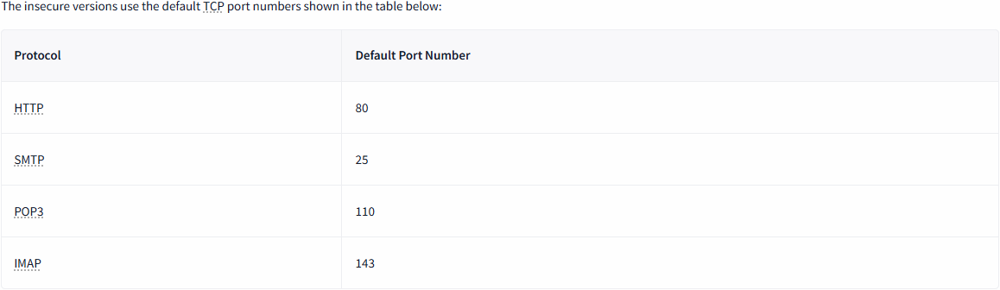
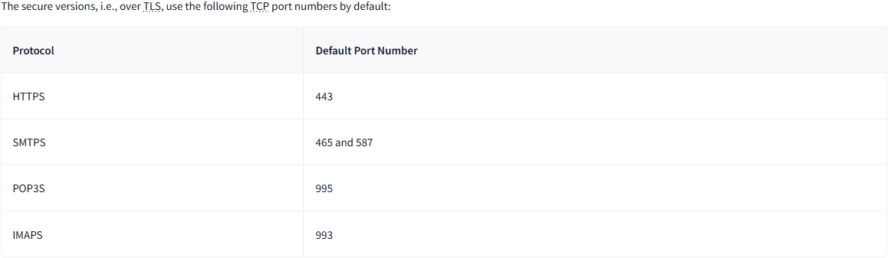

# 4 Networking Secure Protocols

## 4.2 TLS
- `Secure Sockets Layer (SSL)`
- `Transport Layer Security (TLS)`
    - a cryptographic protocol operating at OSI model's `transport layer`.
    - allows secure (confidentiality and integrity) communication between a client and server over a insecure network.
    - ensures that no once can read or modify the exchanged data.
- To get a `TLS Certificate`, the server admin will create a `Certificate Signing Request (CSR)` and submits to a `Certificate Authority (CA)`.

## 4.3 HTTPS
- `HTTP` relies on TCP and uses `port 80` by default.
- As observed using `telnet`, traffic was sent in cleartext for anyone to intercept and monitor.
- common steps before web browser request a page over HTTP:
    1. Establish a TCP three-way handshake with target server
    2. Communicate using HTTP protocol, example `GET / HTTP/1.1
- `HTTPS over TLS` will require the following steps:
    1. Establish a TCP three-way handshake with target server
    2. Establish a TLS session
    3. Communicate using HTTP protocol, example `GET / HTTP/1.1
- adding TLS to HTTP leads to all packets being encypted, we can no longer see the contents of exchanged packets unless we get the private key.

## 4.4 SMTPS, POP3S, and IMAPS

### Insecure Version (TCP)

### Secure Version (TLS)

